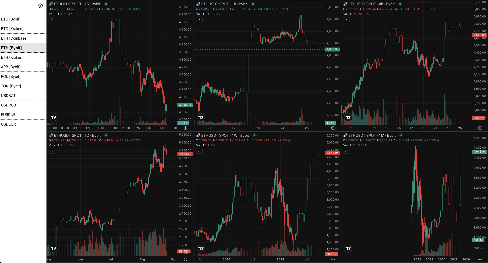

# TradingView Charts Dashboard

A React-based dashboard for monitoring cryptocurrency and forex trading pairs using TradingView's embedded charts. Features multiple timeframes and exchanges for comprehensive market analysis.



## Features

- **Multi-timeframe analysis**: 15m, 1h, 4h, 1D, 1W, 1M intervals
- **Multiple exchanges**: Bybit, Kraken, Coinbase
- **Cryptocurrency pairs**: BTC, ETH, ARB, POL, TON
- **Forex pairs**: USD/KZT, USD/RUB, EUR/RUB, USD/EUR
- **Dark theme** with customizable chart settings
- **Responsive design** with navigation between symbols

## Quick Start

### Using Docker (Recommended)

```bash
# Clone the repository
git clone <repository-url>
cd tradingview

# Start the application
docker-compose up --build
```

The dashboard will be available at [http://localhost:3000](http://localhost:3000).

### Local Development

```bash
# Install dependencies
npm install

# Start development server
npm start
```

## Configuration

Edit `src/lib/input.js` to:
- Add/remove trading symbols
- Modify chart intervals and settings
- Configure exchange preferences

## Available Scripts

- `npm start` - Development server
- `npm test` - Run tests  
- `npm run build` - Production build
- `docker-compose up --build` - Run with Docker
